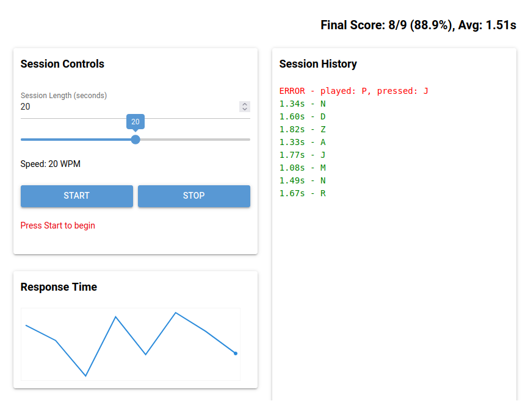

# morse-echo — Morse Code Trainer



A small NiceGUI-based training app that plays single characters in Morse code and measures your reaction time. Built for quick practice sessions to improve Morse recognition speed.

Features
- Play a random character in Morse code and await a single-key response
- Tracks reaction time for correct answers and marks incorrect attempts
- Configurable session length (default 60s)
- Results history and a simple response-time sparkline
- Bell sound at the end of a session

Requirements
- Python 3.12+ (project uses 3.13 in the workspace)
- The project already depends on `nicegui` (see `pyproject.toml`). The app also uses `numpy` and `sounddevice` for audio.

If you use `uv` for package management (as in this project), add the runtime packages with:

```zsh
uv sync
```

Or with pip:

```zsh
python -m pip install nicegui numpy sounddevice
```

How to run

1. Activate your Python environment (virtualenv/venv) where packages are installed.
2. Start the app:

```zsh
python main.py
```

3. Open your browser to http://localhost:8080

Quick usage
- Use the "Session Length" field to set how long you want to practice (seconds).
- Click "Start" to begin a session. There is a 1s buffer before the first character is played.
- Type the letter you heard. If correct, the reaction time is recorded. If incorrect, the attempt is logged and the app moves on.
- Click "Stop" to end the session early. A short bell plays when the session ends.

Notes and customization
- Audio is generated in-code using `numpy` and played with `sounddevice`. If your system has no audio devices or `sounddevice` fails, the app will still run but you won't hear prompts.
- The Morse timing use the PARIS formula according to WPM slider.
- The UI uses NiceGUI; it's straightforward to extend the interface (add charts, summaries, or export results).

Troubleshooting
- If the server fails to start, check the terminal logs. NiceGUI prints the address (e.g., http://localhost:8080).
- run with `--debug` flag to print additional logs to the console.
- If audio playback fails: ensure your system has an audio output device and that `sounddevice` was installed successfully.

License
- MIT

Authors
- N7LFO (Andy)
